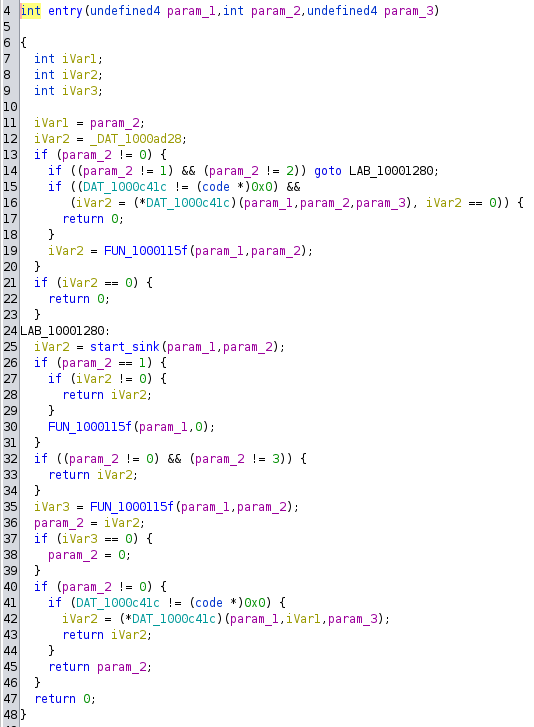

# DLL Injecting

In this week, we learned to detect DLL Injection by analyzing the disassembled codes.

The goal of this lab was to figure out how the lab12-01.exe inject into Windows by answering the below questions.

## Process Overview

I started with the .exe file because it is the loader for the .dll file.

I started with the sink of the .exe file, I know that the program must be openning some processes to access processes, so I searched for function calls to OpenProcess and found a function called in entry() that does this. 

I renamed it to sink().

The overview of sink() in lab12-01.exe is: 

 1. It loads "psapi.dll", which is an interface for getting the process status of application, using LoadLibraryA(). It then uses GetProcAddress() to get the handles of the following functions inside "psapi.dll":

    - EnumProcessModules() (line 41-43)
    - GetModuleBaseNameA() (line 44-46)
    - EnumProcesses() (line 47-49)

    These functions are used to locate the target process into which this malware injects.

  

  2. It gets the curret directory and gets the path to the DLL to inject. 
    
  

  3. It then finds the process into which to inject. It does this by: 
    1. It uses EnumProcesses() to get the PID of each process in the system (line 53). According to https://learn.microsoft.com/en-us/windows/win32/api/psapi/nf-psapi-enumprocesses. 

    2. It loops through halves of the possible PIDs (line 58) and check each process with the check_process(pid) function.

  

  Let's analyze check_process(pid).

  First, it opens pid, uses EnumProcessModules() retrieve the handle for one module in the process according to https://learn.microsoft.com/en-us/windows/win32/api/psapi/nf-psapi-enumprocessmodules. 
  
  Then, it uses GetModuleBaseNameA() to get the base name of that single module. 

  Finally, it uses the contains() function to check if the module name contains the string "explorer.exe". 
  
    
  
  The contains function works like this:
  - It compares each character of the base string to that of the target string. 
  - Line 20 and 23 made sure that upper-case alphabet characters are converted into lower-case versions. 
  - It returns 0 if all characters of the base string upto the target size match with the target string.
  - It returns 0xffffffff if there is a character that is not the same. 
  - It returns 0x1 if the ASCII value of the target character is not greater than the base character. 

        

  4. After finding the right process, it allocates a space in the target process memory. 
  
  Then, it writes the DLL to that memory address. 
  
  It then find the LoadLibraryA() function inside the target process. 
  
  It creates a remote thread in the target process using GetProcAddress() and runs the LoadLibraryA() function in that thread to load the DLL under the target process. 
  
  This is the most obvious sign of a DLL injection.  

   

Now, let's analyze the Lab12-01.dll that was loaded by the .exe file.

Using PEViewer did not show any exported function that the dll have. However, using Ghidra showed that there was the entry function, which is the start of the program, so DLLMain is the entry() function in the .dll file. 

The overview of the process of the .dll file is:

  1. The entry function, which is the start of the program, has 3 parameters. 
  2. Given the information below that the programs periodically do things. 
  
  Using forward engineering, I guess that the program must use the Sleep function to wait. Thus, I searched for instances of Sleep() and found a function that has a while loop and Sleep. 
  
  Looking for references of Sleep() only shows one function, so the function that I found was probably the right one. 
  
  I renamed the function to sink(). 
  
  Tracing references of sink, I found the function that called sink() from entry(), I renamed the function to start_sink(). 

## Answer
1. Prove that the loader is using DLL injection. (Don't forget a relevant snapshot in Ghidra.)

The loader was using DLL Injection. 

The reason is because of the following steps in the above process overview: 

  1. Step 4: Write the DLL to the memory of the process. 
  2. Step 4: Create a remote thread in the target process to load the DLL. 
 
2. Identify the process that will be injected into. Seeing a string in Ghidra isn't sufficient -- explain how the process gets selected.

The proces that will be injected into is "explorer.exe", which is the Windows File Explorer.

This is because in step 3 above, when the program finds the process to inject the DLL, it was checking the module name of the process to see if it contains the string "explorer.exe". 

3. Identify the entry point of the DLL injection. Where is DllMain?

DLLMain is the entry function. This is because when a DLL is loaded, it loads the entry function of the program. 

This is also because when using PEViewer, there were no functions exported and in the .exe file, it was not loading any specific function. 

 

4. This malware does something every ______ seconds. How often, and where is the loop where that waiting happens?

The malware does something every 60,000 miliseconds. 

Link to Sleep: https://learn.microsoft.com/en-us/windows/win32/api/synchapi/nf-synchapi-sleep

 

5. What does the malware do every _______ seconds?

Every 60,000 miliseconds, it does action() function which accepts a buffer and the string "Malware Analysis %d". 

 