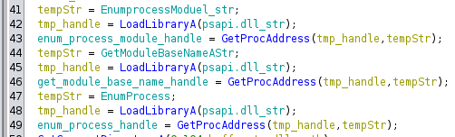

# DLL Injecting

In this week, we learned to detect DLL Injection by analyzing the disassembled codes.

The goal of this lab was to figure out how the lab12-01.exe inject into Windows by answering the below questions.

## Process Overview

I started with the sink, I know that the program must be openning some processes to access processes, so I searched for function calls to OpenProcess and found a function called in entry() that does this. I renamed it to sink() (see image below).

The overview of the process is: 

 1. It loads "psapi.dll", which is an interface for getting the process status of application, using LoadLibraryA(). It then uses GetProcAddress() to get the handles of the following functions inside "psapi.dll":
      - EnumProcessModules() (line 41-43)
      - GetModuleBaseNameA() (line 44-46)
      - EnumProcesses() (line 47-49)
    These functions are used to locate the target process into which this malware injects.

    

  2. It gets the curret directory and gets the path to the DLL to inject. 
  3. It then finds the process into which to inject. It does this by: 
      1. It uses EnumProcesses() to get the PID of each process in the system (line...). According to https://learn.microsoft.com/en-us/windows/win32/api/psapi/nf-psapi-enumprocesses. 
      2. It loops through halves of the possible PIDs (line...) and check each process with the check_process(pid) function.
      First, it opens pid, uses EnumProcessModules() retrieve the handle for one module in the process according to https://learn.microsoft.com/en-us/windows/win32/api/psapi/nf-psapi-enumprocessmodules. 
      Then, it uses GetModuleBaseNameA() to get the base name of that single module. 
      Finally, it uses the contains() function to check if the module name contains the string "explorer.exe". The contains function works like this...
  4. After finding the right process, it allocates a space in the target process memory. 
  5. Then, it writes the DLL to that memory address. 
  6. It then find the LoadLibraryA() function inside the target process. 
  7. It creates a remote thread in the target process using GetProcAddress() and runs the LoadLibraryA() function in that thread to load the DLL under the target process. This is the most obvious sign of a DLL injection.  

## Answer
1. Prove that the loader is using DLL injection. (Don't forget a relevant snapshot in Ghidra.)

The loader was using DLL Injection. 
The reason is because of the following steps in the above process overview: 
  1. Step 4: Write the DLL to the memory of the process. 
  2. Step 6-7: Create a remote thread in the target process to load the DLL. 
 
2. Identify the process that will be injected into. Seeing a string in Ghidra isn't sufficient -- explain how the process gets selected.

The proces that will be injected into is "explorer.exe", which is the Windows File Explorer.

This is because in step 3 above, when the program finds the process to inject the DLL, it was checking the module name of the process to see if it contains the string "explorer.exe". 

3. Identify the entry point of the DLL injection. Where is DllMain?

4. This malware does something every ______ seconds. How often, and where is the loop where that waiting happens?

5. What does the malware do every _______ seconds?